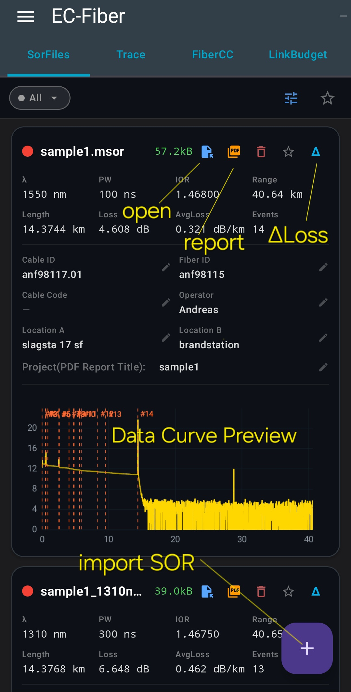

# EC Fiber Toolkit

EC Fiber Toolkit is an Android app for fiber optic engineers and technicians.  
It provides OTDR SOR file analysis, trace comparison, PDF report export, fiber color code lookup, link budget calculation, and other useful optical fiber tools in a single lightweight application.

Designed for FTTH, ISP, and fiber maintenance work.

Developed and maintained by **EmbeddedChan**.

## 📥 Download

Latest Version:

[Download EC-Fiber-Toolkit-v0.9.3.apk](https://github.com/EmbeddedChan/otdr-sor-parser/raw/main/apk/EC-Fiber-Toolkit-v0.9.3.apk)

This app is currently not available on Google Play.

## Privacy

This application does not request unnecessary permissions and does not collect, store, or share your user data.

All file processing and analysis are performed locally on the device.

## The application includes the following modules:

### SOR Parser Module
- SOR File Management
- OTDR Trace Display
- PDF Report Export

### Link Budget Module
- Receiver Power Verification
- High-Speed Optical Link Analysis

### Fiber Optic Color Code Module
- Color Code Lookup
- Fiber cable Mapping

### Tools Module
- Optical Power Converter
- Splitter Loss Calculator
- WDM λ ↔ Frequency / ITU Channel Converter
- OTDR Time-Distance Converter

## 🖼 UI Preview

## 📦 Version History

### v0.9.3
- Renamed app to EC Fiber Toolkit
- Added curve comparison mode for easier fiber trace analysis

### v0.9.1
- Added fiber optic color code lookup and mapping module
(Pro, Cable >144 fibers)
### v0.8.2
- Added Link Budget module (configuration save support)
- Added OTDR trace topology view
- Added Splitter Loss Calculator
- Added WDM wavelength/frequency + ITU grid mapping

### v0.8.1
- Added engineering tools module
- Optical power converter
- OTDR time–distance converter

### v0.7.2
- Fixed event data handling in SOR PDF report

### v0.7.1
- Added Link Budget module
- Receiver power check
- Optical link analysis engine

### v0.6.2
- SOR file management added
- MSOR import support
- PDF report editing fields added

### v0.3.0
- PDF report export (Pro, no watermark)
- File name display

### v0.2.1
- Initial release

## Feedback & Support

Welcome your feedback, feature requests, and bug reports.  
Please email me anytime.

Email: embeddedchan@gmail.com

## Licensing

EC Fiber Toolkit is available in two editions:

### Free Version
Includes core features for OTDR file viewing and basic fiber analysis.

### Pro Version
Unlocks advanced features, including:
- Watermark-free PDF report export
- Cable fibers >144

Pro features require a valid license.
