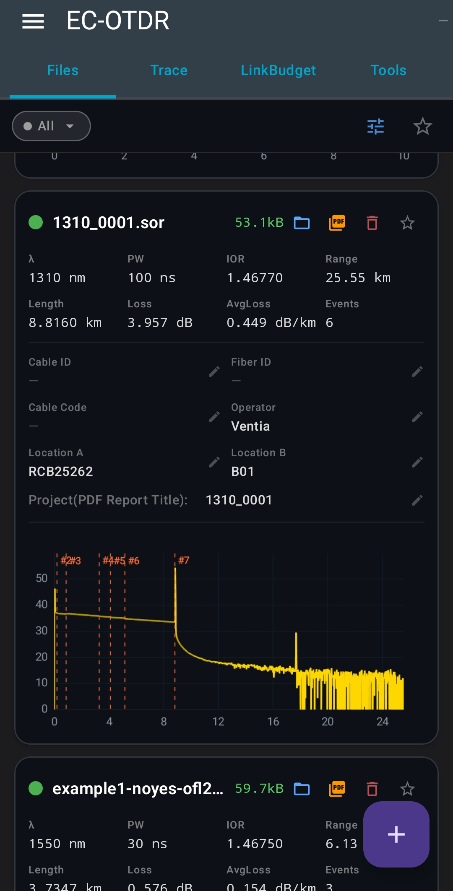
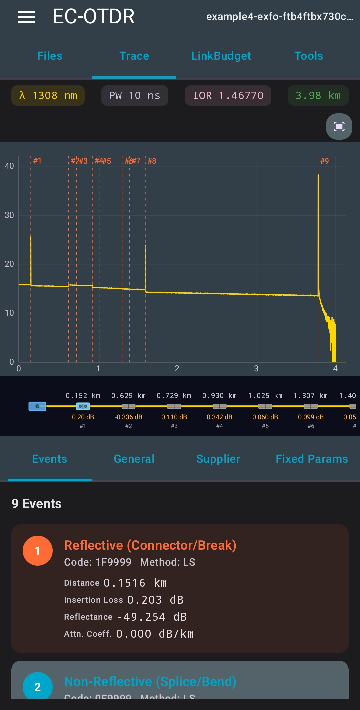
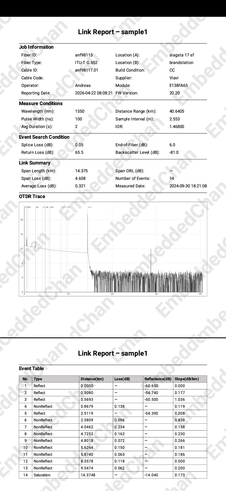
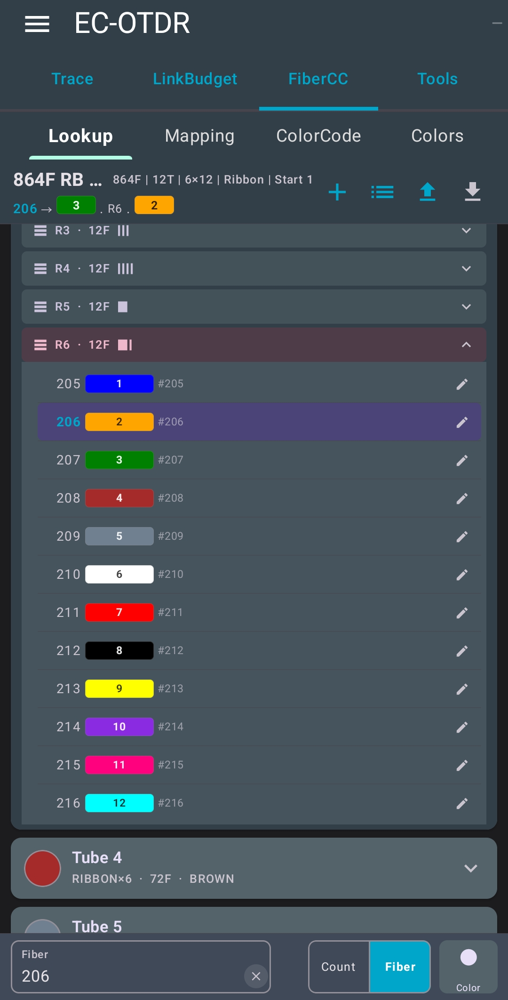
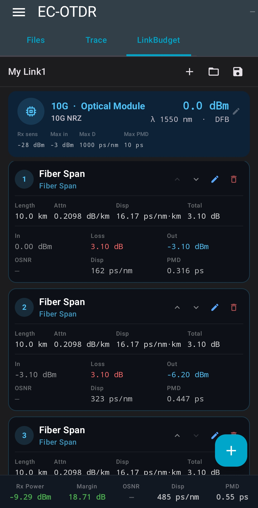
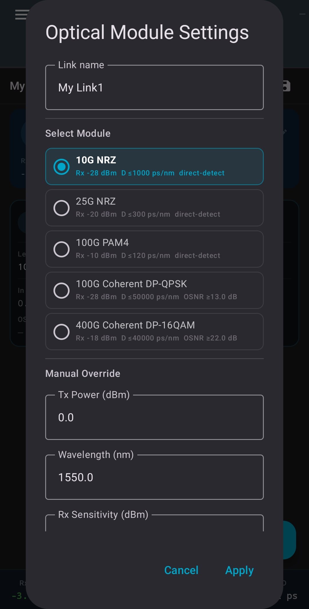
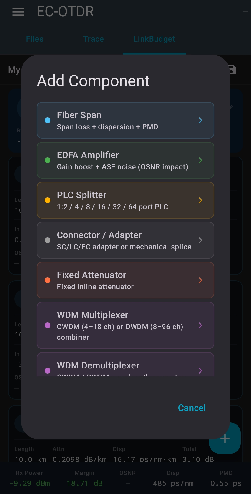
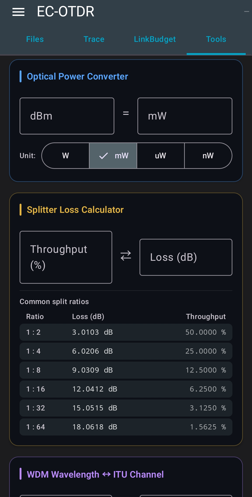

# EC OTDR Viewer
A small Android app for viewing and analyzing OTDR .sor files. It supports parsing the SOR file format, visualizing the fiber trace and event information, and generating PDF reports.
The app is still under development, with ongoing improvements to parsing, visualization, and report generation.

Developed and maintained by **EmbeddedChan**.

## 📥 Download

Latest Version:

[Download EC-OTDR-Viewer-v0.9.1.apk](https://github.com/EmbeddedChan/otdr-sor-parser/raw/main/apk/EC-OTDR-Viewer-v0.9.1.apk)

## Modules

The application includes the following modules:

### SOR Parser Module
- SOR File Management
- OTDR Trace Display
- PDF Report Export

### Link Budget Module
- Receiver Power Verification
- High-Speed Optical Link Analysis

### Fiber Optic Color Code Module
- Color Code Lookup
- Fiber Mapping

### Tools Module
- Optical Power Converter
- Splitter Loss Calculator
- WDM λ ↔ Frequency / ITU Channel Converter
- OTDR Time-Distance Converter

## 🖼 UI Preview

# 📡 EC OTDR Viewer – Feature Overview

EC OTDR Viewer is a lightweight and powerful fiber optic analysis tool designed for OTDR trace visualization, link analysis, and telecom engineering utilities. It provides an all-in-one toolkit for fiber engineers, installers, and network testers.

---

## 📊 SOR Parser & OTDR Trace Viewer

### 📁 SOR File Management
- Import and manage Telcordia SR-4731 standard SOR files  
- Multi-file handling for fiber link comparison (Coming soon) 

### 📈 OTDR Trace Visualization
- High-performance trace curve rendering  
- Zoom, pan, and event inspection support  
- Multi-trace comparison (up to multiple fibers)(Coming soon)  

### 📄 PDF Report Export
- Generate OTDR test reports  (Pro, no watermark)
- Include trace graphs and event summaries  
- Easy sharing and documentation workflow  

---

## 🔗 Link Budget Module

### ⚡ Basic Receiver Power Check
- Quickly verify optical receiver power levels  
- Simple pass/fail analysis for field use  

### 🌐 High-Speed Optical Link Analysis
- Full link budget calculation  
- Supports multi-span fiber networks  
- Designed for telecom and data center planning  

---

## 🎨 Fiber Optic Color Code Module

### 🔍 Color Code Lookup
- Support for common fiber standards (e.g. TIA-598)  
- Fast reference for fiber identification  

### 🧩 Fiber Mapping Tool
- Map fibers inside loose tube / ribbon structures  
- Visualize fiber organization and numbering  
- Supports multi-fiber cable structures  
(Pro, cable>144F,import data)

---

## 🛠 Tools Module

### 🔌 Optical Power Converter
- dBm ↔ mW conversion  
- Fast and accurate power unit translation  

### ➗ Splitter Loss Calculator
- Calculate insertion loss for optical splitters  
- Support common split ratios (1:2, 1:4, 1:8, etc.)  

### 📡 WDM Tool (ITU Grid Supported)
- Wavelength ↔ Frequency conversion  
- ITU channel mapping (DWDM/CWDM grid support)  

### ⏱ OTDR Time–Distance Converter
- Convert pulse time to fiber distance  
- Useful for OTDR event interpretation  

---

## 🚀 Designed For

- Fiber optic engineers  
- Telecom field technicians  
- Network installation teams  
- Optical lab testing  
- Data center infrastructure engineers

## 📦 Version History

Show changelog

### v0.9.1
- Added fiber optic color code lookup and mapping module

### v0.8.2
- Added Link Budget module (configuration save support)
- Added OTDR trace topology view
- Added Splitter Loss Calculator
- Added WDM wavelength/frequency + ITU grid mapping

### v0.8.1
- Added engineering tools module
- Optical power converter
- OTDR time–distance converter

### v0.7.2
- Fixed event data handling in SOR PDF report

### v0.7.1
- Added Link Budget module
- Receiver power check
- Optical link analysis engine

### v0.6.2
- SOR file management added
- MSOR import support
- PDF report editing fields added

### v0.3.0
- PDF report export (Pro)
- File name display

### v0.2.1
- Initial release

This application performs all data processing locally on the device. It does not require an internet connection and does not collect, store, or transmit any user data.
Welcome your feedback, feature requests, and bug reports. Please email me anytime.
Email: embeddedchan@gmail.com
