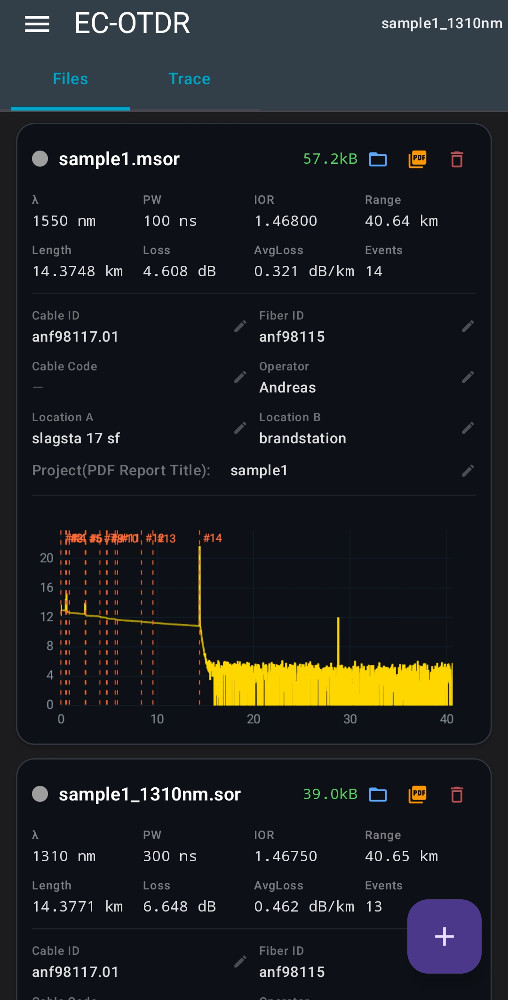
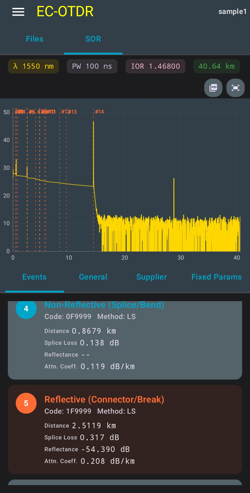
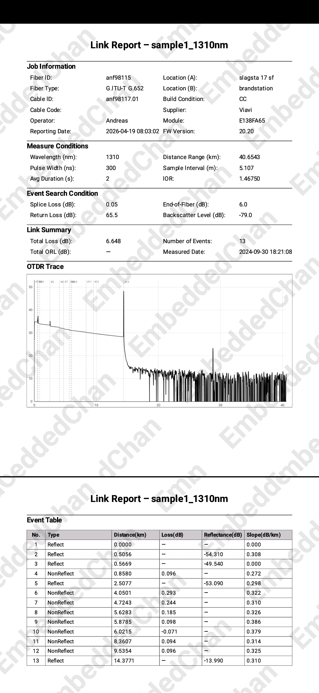

# EC OTDR Viewer
A small Android app for viewing and analyzing OTDR .sor files. It supports parsing the SOR file format, visualizing the fiber trace and event information, and generating PDF reports.
The app is still under development, with ongoing improvements to parsing, visualization, and report generation.

This application performs all data processing locally on the device. It does not require an internet connection and does not collect, store, or transmit any user data.

Developed and maintained by **EmbeddedChan**.

## 📥 Download

Latest Version:

[Download EC-OTDR-Viewer-v0.6.3.apk](https://github.com/EmbeddedChan/otdr-sor-parser/raw/main/apk/EC-OTDR-Viewer-v0.6.3.apk)

## TODO
- Multi-trace comparison (display and compare multiple OTDR traces) 

## Version History

### v0.6.3(2026-04-22)

#### PDF Report
- Fixed: Fiber type
- Added: Span length, average loss
- Updated: "Total Loss" → "Span Loss"

### v0.6.2

#### Added
- SOR File Management
- MSOR File Import

#### Improved
- PDF report:
  - The following fields can now be edited:
    1. Report Title
    2. Cable ID
    3. Fiber ID
    4. Location A
    5. Location B
    6. Cable Code
    7. Operator

### v0.3.0
Added
- PDF report export (Pro: no watermark)
- File name display

### v0.2.1
- Initial release

## 🖼 UI Preview

