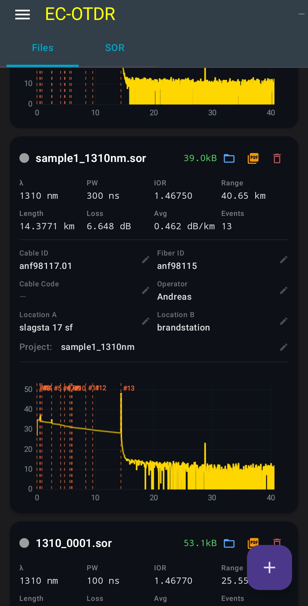

# EC OTDR Viewer
A small Android app for viewing and analyzing OTDR .sor files. It can parse the SOR file format and display the fiber trace and event information.
The app is still under development, and I'm continuing to improve the parser and visualization.

Developed and maintained by **EmbeddedChan**.

## 📥 Download

Latest Version:

[Download EC-OTDR-Viewer-v0.6.2.apk](https://github.com/EmbeddedChan/otdr-sor-parser/raw/main/apk/EC-OTDR-Viewer-v0.6.2.apk)

## Version History
### v0.6.2
Added
- SOR File Management
- MSOR File Import
- Improved PDF report,following information can now be edited:
1.report title
2.cableId
3.fiberId
4.locationA
5.locationB
6.cableCode
7.operator

### v0.3.0
Added
- PDF report export (Pro: no watermark)
- File name display

### v0.2.1
- Initial release

## 🖼 UI Preview

