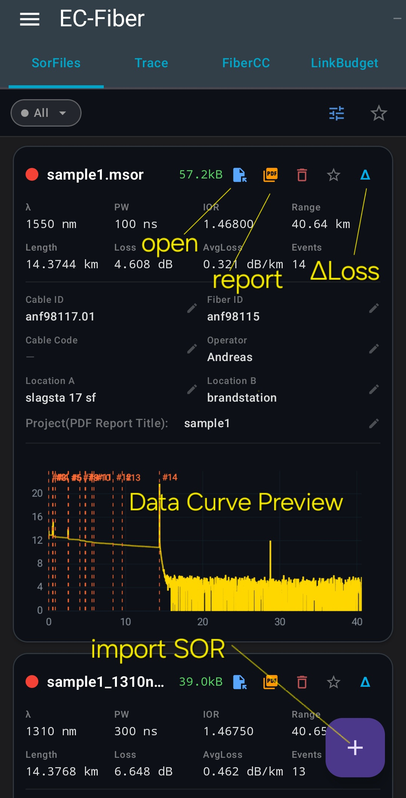
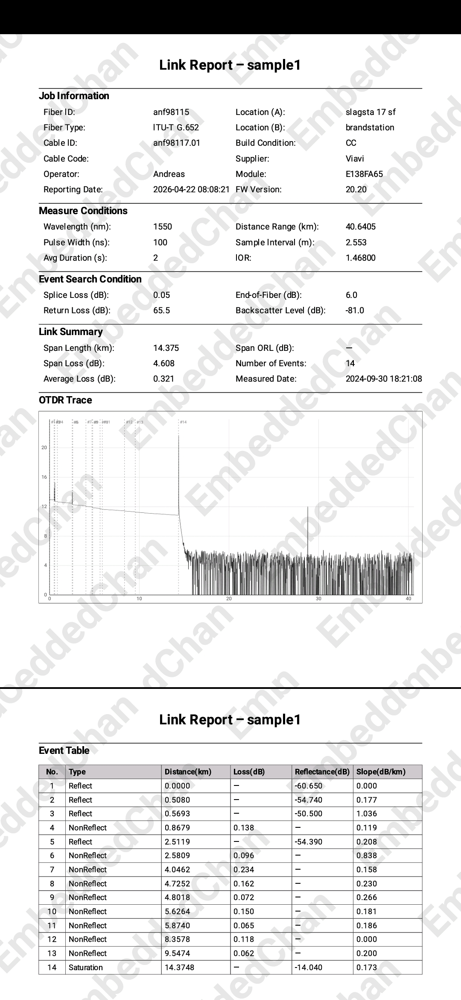
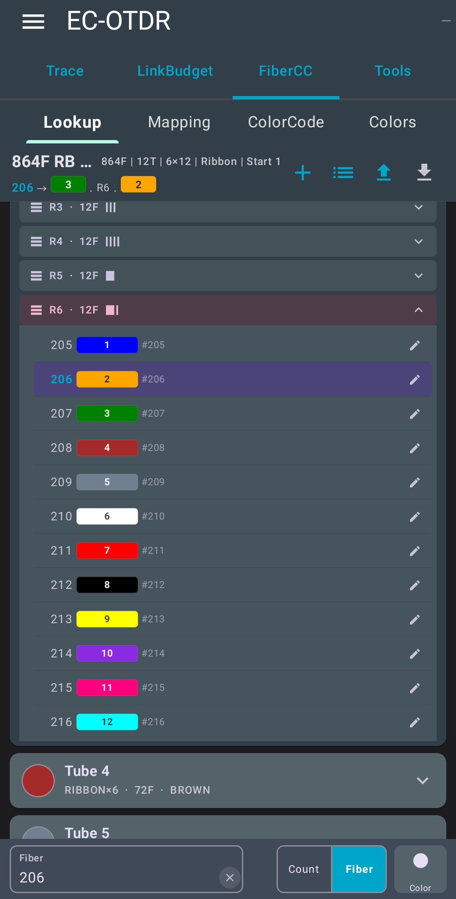
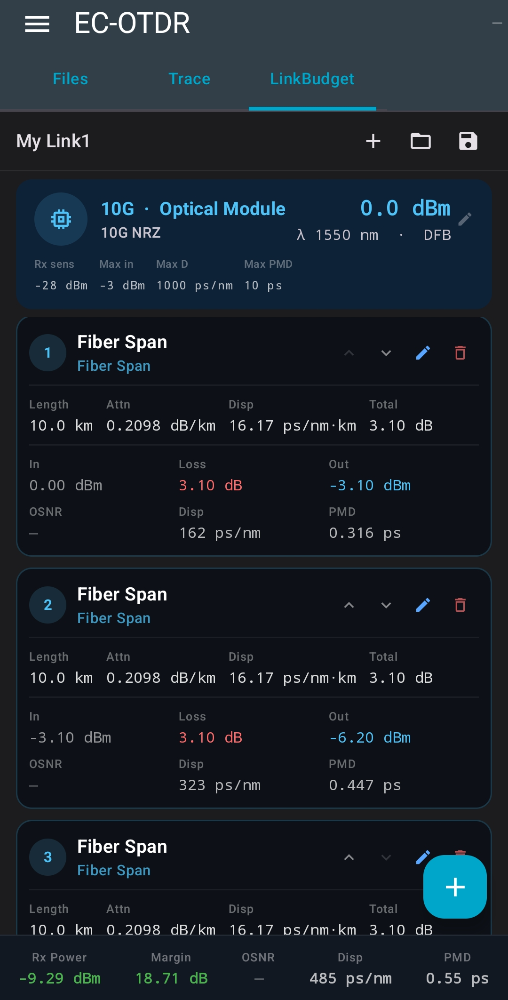
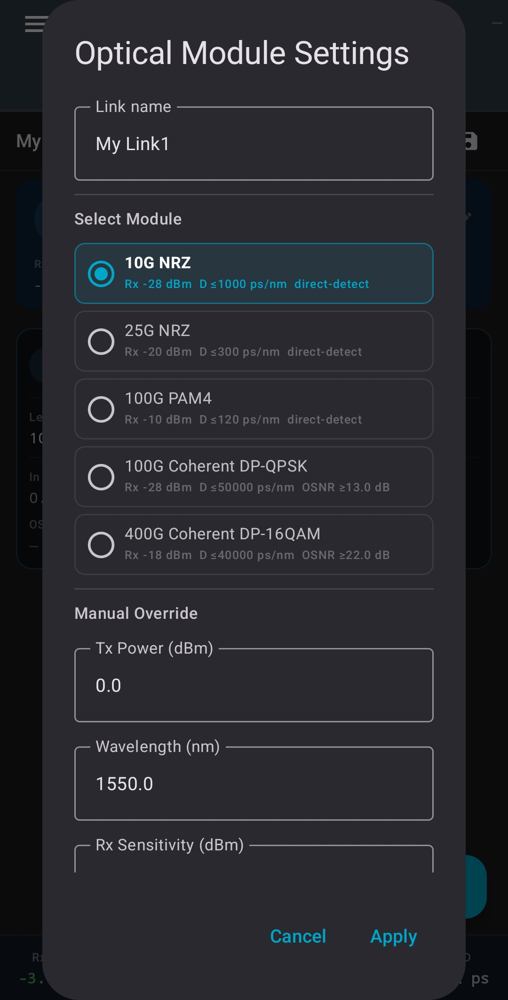
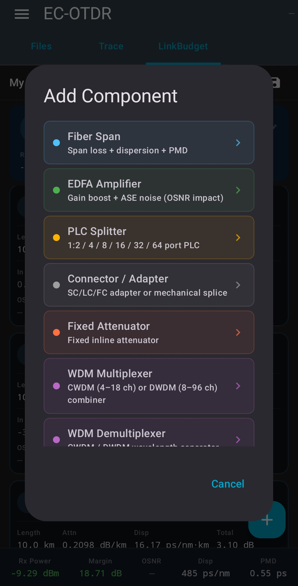
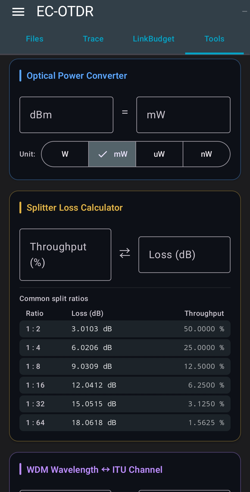

# EC-FusionKit

EC-FusionKit is an Android app for OTDR SOR file viewer, trace comparison, PDF report, fiber color code lookup, optical link budget calculation, and other useful optical fiber tools in a single lightweight application.

Developed and maintained by **EmbeddedChan**.

> **Note:** This project is distributed as the **Optical edition of EC FusionKit**.

## 📥 Download

Last updated: 2026-09-08

[Download EC-FusionKit-v1.13.8.apk](https://github.com/EmbeddedChan/otdr-sor-viewer/raw/main/apk/EC-FusionKit-v1.13.8.apk)

Please uninstall EC-OpticKit DroidOTDR before installing EC-FusionKit.

This app is currently not available on Google Play.

PCB design services → Fiverr
https://www.fiverr.com/s/61bjr6L

```text
EC FusionKit
│
│
├── Optical
│   ├── SorFiles
│   ├── OTDR Trace
│   ├── Tools
│   ├── Fiber Color Code
│   ├── Link Budget 
│   └── SFP DDM
│
└── Utilities
     ├── HEX/BIN/DEC Converter
     ├── Hex Editor
     ├── Calculator
     └── Text File Compare
```


## 🖼 UI Preview




Hold the line until the circle grows, then drag · R² closer to 1 = straighter fit














## 📦 Version History

### v1.13.8
Changed the display units of Backscatter Coefficient, Noise Floor Level, and Reflectance Threshold to dB.

### v1.13.7

- Added Privacy Policy statement.
- Added Donation information.

### v1.13.5
- Fiber Optic Color Code is now free for everyone

### v1.13.2
- Renamed app to EC FusionKit

### v1.8.4
- Added measurement functionality in OTDR Trace Full View

### v1.8.3
- Added Table View for OTDR event list

### v1.8.2
- Added full-screen view for OTDR trace charts

### v1.8.1
- Fixed a LineChart initialization issue that caused trace lines to appear thinner than expected.

### v1.8.0
- Added distance resolution to Trace view
- Fixed an issue where ".sor" file parsing could occasionally freeze
- Enabled side drawer gesture support for easier navigation
- Added STM32 programming support to the Hex Editor

### v1.6.0
- Added SFP DDM parser module
- Added USB serial terminal
- Added HEX file editor
- Added file comparator
- Improved LinkBudget page state retention when switching pages

### v1.0.3
- Fixed missing Tube Color Code expansion rule handling in Fiber Color Code color lookup
- Fixed an issue causing intermittent cable data loading failures

### v1.0.2
- Fixed crash caused by Android theme switching

### v1.0.1
- Added SCPI raw socket terminal
- Renamed app to EC OpticKit
### v0.9.3
- Added curve comparison mode for easier fiber trace analysis

### v0.9.1
- Added fiber optic color code lookup and mapping module

### v0.8.2
- Added Link Budget module (configuration save support)
- Added OTDR trace topology view
- Added Splitter Loss Calculator
- Added WDM wavelength/frequency + ITU grid mapping

### v0.8.1
- Added engineering tools module
- Optical power converter
- OTDR time–distance converter

### v0.7.2
- Fixed event data handling in SOR PDF report

### v0.7.1
- Added Link Budget module
- Receiver power check
- Optical link analysis engine

### v0.6.2
- SOR file management added
- MSOR import support
- PDF report editing fields added

### v0.3.0
- PDF report export (Pro, no watermark)
- File name display

### v0.2.1
- Initial release


## Feedback & Support

Welcome your feedback, feature requests, and bug reports.  
Please email me anytime.

Email: embeddedchan@gmail.com

## Support Development

If you find this project useful, consider supporting its development with a donation.

Donation (TRON / TRX / USDT-TRC20)


Address:
`TWJxB5izJwCg7Q2cTVFkp9ZjamsFmE2UqV`

Supporters may receive

- Priority technical support
- Custom builds for specific devices or requirements
- Custom feature development (when feasible)
- Early access to new features and beta versions
- Help with integration or troubleshooting

Your support helps keep this project actively maintained and improved. Thank you!


## Licensing

EC-FusionKit is available in two editions:

### Free Version
Includes all standard features, except Pro-exclusive functions.

### Pro Version
Unlocks advanced features, including:
- Watermark-free PDF report export

## Privacy Policy

This application does not collect personal information.All file processing, and engineering tools operate locally on the user's device.

For license validation purposes, the application may generate and transmit a unique installation identifier Android ID. This identifier is used solely for professional edition license verification.

